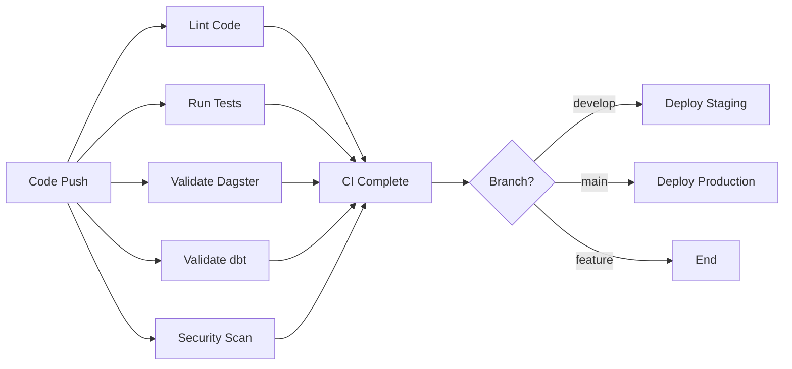

# Dagger CI/CD Pipeline for Dagster + dbt + Snowflake

This project uses [Dagger](https://dagger.io) to provide a powerful, portable CI/CD pipeline that runs the same way locally and in CI.

## 🚀 Features

- **🔍 Code Quality**: Linting with ruff, black, and isort
- **🧪 Testing**: Comprehensive Dagster test execution
- **✅ Validation**: Dagster definitions and dbt model validation
- **🔒 Security**: Dependency vulnerability scanning
- **📚 Documentation**: Automated doc generation
- **🚀 Deployment**: Staging and production deployment with Snowflake

## 📋 Prerequisites

- [Dagger](https://docs.dagger.io/install) installed locally
- Docker running on your machine
- Python 3.13+ for local development

## 🏃‍♂️ Quick Start

### Run the full CI pipeline locally:
```bash
./scripts/run-ci.sh
```

### Run individual steps:
```bash
# Show all available commands
./scripts/run-step.sh help

# Run specific steps
./scripts/run-step.sh lint
./scripts/run-step.sh test
./scripts/run-step.sh validate-dagster
./scripts/run-step.sh validate-dbt
```

### Manual Dagger commands:
```bash
# Run full CI pipeline
dagger -m .dagger call full-ci-pipeline --source=.

# Run individual functions
dagger -m .dagger call lint-code --source=.
dagger -m .dagger call test-dagster --source=.
dagger -m .dagger call validate-dagster-definitions --source=.
dagger -m .dagger call validate-dbt --source=.
dagger -m .dagger call security-scan --source=.
```

## 🏗️ Pipeline Architecture

The Dagger pipeline consists of several functions:

### Core CI Functions

1. **`python_base`**: Creates base Python container with common dependencies
2. **`lint_code`**: Runs code linting (ruff, black, isort)
3. **`test_dagster`**: Executes Dagster tests with pytest
4. **`validate_dagster_definitions`**: Validates Dagster definitions load correctly
5. **`validate_dbt`**: Validates dbt models and configuration
6. **`security_scan`**: Runs security scanning on dependencies
7. **`full_ci_pipeline`**: Orchestrates all CI checks

### Deployment Functions

8. **`deploy_staging`**: Deploys to staging environment
9. **`deploy_production`**: Deploys to production (after CI validation)
10. **`build_documentation`**: Generates project documentation

## 🔧 Configuration

### Environment Variables

For local development, you can set these environment variables:

```bash
export SNOWFLAKE_ACCOUNT="your-account"
export SNOWFLAKE_USER="your-user"  
export SNOWFLAKE_PASSWORD="your-password"
```

### GitHub Secrets

Set up the following secrets in your GitHub repository:

**For CI:**
- `DAGGER_CLOUD_TOKEN` (optional - for Dagger Cloud integration)

**For Staging Deployment:**
- `SNOWFLAKE_ACCOUNT_STAGING`
- `SNOWFLAKE_USER_STAGING`
- `SNOWFLAKE_PASSWORD_STAGING`

**For Production Deployment:**
- `SNOWFLAKE_ACCOUNT_PROD`
- `SNOWFLAKE_USER_PROD`
- `SNOWFLAKE_PASSWORD_PROD`

## 🔄 CI/CD Workflow

### Branch Strategy

- **`main`**: Production deployments (after CI passes)
- **`develop`**: Staging deployments (after CI passes)
- **Feature branches**: CI only (no deployment)

### Pipeline Flow



## 🚨 Troubleshooting

### Common Issues

1. **Docker not running**: Ensure Docker Desktop is running
2. **Permission issues**: Make sure scripts are executable: `chmod +x scripts/*.sh`
3. **Dagger version**: Update to latest Dagger version if encountering issues

### Debugging

Run with verbose logging:
```bash
dagger -m .dagger call full-ci-pipeline --source=. --debug
```

View Dagger logs:
```bash
dagger -m .dagger call full-ci-pipeline --source=. -v
```

## 📊 Pipeline Benefits

### vs Traditional CI/CD:
- ✅ **Consistency**: Same pipeline runs locally and in CI
- ✅ **Speed**: Efficient caching and parallelization
- ✅ **Portability**: Works with any CI provider
- ✅ **Debugging**: Test pipeline changes locally before pushing

### vs GitHub Actions alone:
- ✅ **Vendor Independence**: Not locked to GitHub
- ✅ **Local Testing**: Full pipeline testing locally
- ✅ **Better Caching**: More efficient container layer caching
- ✅ **Composability**: Functions can be combined in different ways

## 🔧 Customization

### Adding New Pipeline Steps

1. Add a new function to `.dagger/src/dagster_demo/main.py`
2. Update `scripts/run-step.sh` to include the new step
3. Optionally add it to the `full_ci_pipeline` function

### Modifying Existing Steps

Edit the functions in `.dagger/src/dagster_demo/main.py` and test locally:

```bash
dagger -m .dagger call your-function-name --source=.
```

## 📚 Additional Resources

- [Dagger Documentation](https://docs.dagger.io)
- [Dagger Python SDK](https://docs.dagger.io/sdk/python)
- [Dagster Documentation](https://docs.dagster.io)
- [dbt Documentation](https://docs.getdbt.com)

---

*This pipeline provides a robust, testable, and portable CI/CD solution for modern data engineering workflows.*
